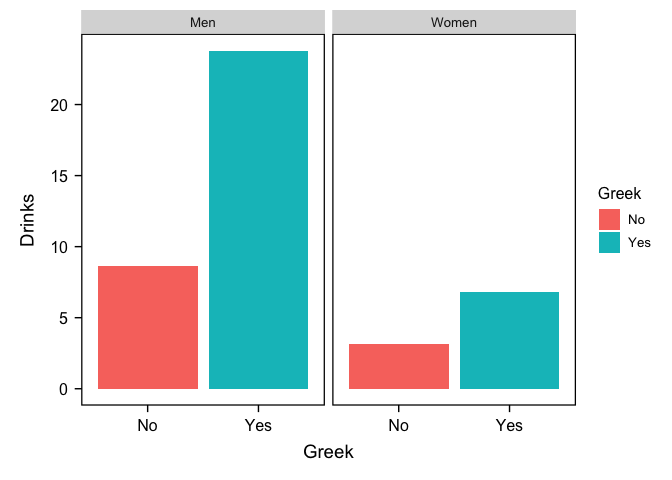
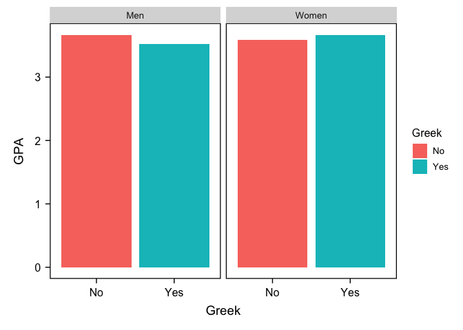
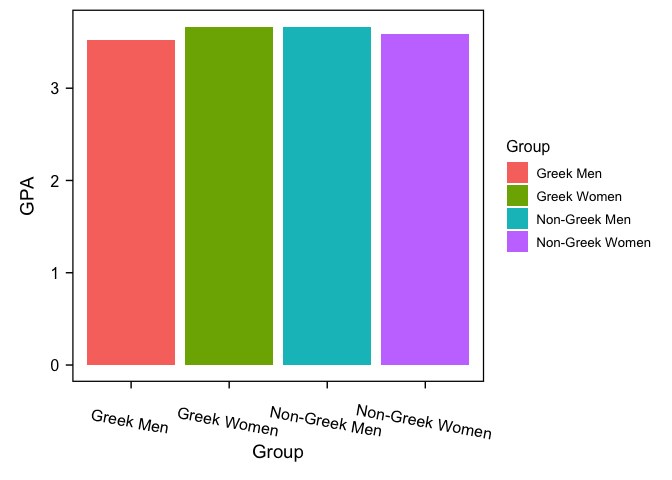

Lab5
================
Rainbow
2024-10-03

# Load packages and dataset

``` r
library(haven)
library(ggplot2)
library(Rmisc)
```

    ## Loading required package: lattice

    ## Loading required package: plyr

``` r
library(rstatix)
```

    ## 
    ## Attaching package: 'rstatix'

    ## The following objects are masked from 'package:plyr':
    ## 
    ##     desc, mutate

    ## The following object is masked from 'package:stats':
    ## 
    ##     filter

``` r
library(emmeans)
```

    ## Welcome to emmeans.
    ## Caution: You lose important information if you filter this package's results.
    ## See '? untidy'

``` r
library(bruceR)
```

    ## 
    ## bruceR (v2024.6)
    ## Broadly Useful Convenient and Efficient R functions
    ## 
    ## Packages also loaded:
    ## ✔ data.table ✔ emmeans
    ## ✔ dplyr      ✔ lmerTest
    ## ✔ tidyr      ✔ effectsize
    ## ✔ stringr    ✔ performance
    ## ✔ ggplot2    ✔ interactions
    ## 
    ## Main functions of `bruceR`:
    ## cc()             Describe()  TTEST()
    ## add()            Freq()      MANOVA()
    ## .mean()          Corr()      EMMEANS()
    ## set.wd()         Alpha()     PROCESS()
    ## import()         EFA()       model_summary()
    ## print_table()    CFA()       lavaan_summary()
    ## 
    ## For full functionality, please install all dependencies:
    ## install.packages("bruceR", dep=TRUE)
    ## 
    ## Online documentation:
    ## https://psychbruce.github.io/bruceR
    ## 
    ## To use this package in publications, please cite:
    ## Bao, H.-W.-S. (2024). bruceR: Broadly useful convenient and efficient R functions (Version 2024.6) [Computer software]. https://CRAN.R-project.org/package=bruceR

    ## 
    ## These packages are dependencies of `bruceR` but not installed:
    ## - pacman, openxlsx, ggtext, lmtest, vars, phia, MuMIn, GGally
    ## 
    ## ***** Install all dependencies *****
    ## install.packages("bruceR", dep=TRUE)

``` r
library(dplyr)
library(labelled)

lab5 <- read.csv("/Users/rainbow/Documents/GitHub/Lab5/lab5/lab5data.csv")
```

# Recode Variables

``` r
lab5 <- lab5 %>%
  mutate_at(c('Gender'),funs(str_replace(., "0", "Men")))
```

    ## Warning: `funs()` was deprecated in dplyr 0.8.0.
    ## ℹ Please use a list of either functions or lambdas:
    ## 
    ## # Simple named list: list(mean = mean, median = median)
    ## 
    ## # Auto named with `tibble::lst()`: tibble::lst(mean, median)
    ## 
    ## # Using lambdas list(~ mean(., trim = .2), ~ median(., na.rm = TRUE))
    ## Call `lifecycle::last_lifecycle_warnings()` to see where this warning was
    ## generated.

``` r
lab5 <- lab5 %>%
  mutate_at(c('Gender'),funs(str_replace(., "1", "Women")))
```

    ## Warning: `funs()` was deprecated in dplyr 0.8.0.
    ## ℹ Please use a list of either functions or lambdas:
    ## 
    ## # Simple named list: list(mean = mean, median = median)
    ## 
    ## # Auto named with `tibble::lst()`: tibble::lst(mean, median)
    ## 
    ## # Using lambdas list(~ mean(., trim = .2), ~ median(., na.rm = TRUE))
    ## Call `lifecycle::last_lifecycle_warnings()` to see where this warning was
    ## generated.

``` r
lab5 <- lab5 %>%
  mutate_at(c('Greek'),funs(str_replace(., "0", "No")))
```

    ## Warning: `funs()` was deprecated in dplyr 0.8.0.
    ## ℹ Please use a list of either functions or lambdas:
    ## 
    ## # Simple named list: list(mean = mean, median = median)
    ## 
    ## # Auto named with `tibble::lst()`: tibble::lst(mean, median)
    ## 
    ## # Using lambdas list(~ mean(., trim = .2), ~ median(., na.rm = TRUE))
    ## Call `lifecycle::last_lifecycle_warnings()` to see where this warning was
    ## generated.

``` r
lab5 <- lab5 %>%
  mutate_at(c('Greek'),funs(str_replace(., "1", "Yes")))
```

    ## Warning: `funs()` was deprecated in dplyr 0.8.0.
    ## ℹ Please use a list of either functions or lambdas:
    ## 
    ## # Simple named list: list(mean = mean, median = median)
    ## 
    ## # Auto named with `tibble::lst()`: tibble::lst(mean, median)
    ## 
    ## # Using lambdas list(~ mean(., trim = .2), ~ median(., na.rm = TRUE))
    ## Call `lifecycle::last_lifecycle_warnings()` to see where this warning was
    ## generated.

# Note that for this lab you will assume assumptions are met, but for your own dataset, you should always check assumptions first

# How to conduct planned contrasts?

## Step 1: Recode 2x2 into 1x4

``` r
lab5$Group <- ifelse(lab5$Gender == "Women" & lab5$Greek == "Yes", "Greek Women", 
                     ifelse(lab5$Gender == "Men" & lab5$Greek == "Yes", "Greek Men", 
                            ifelse(lab5$Gender == "Women" & lab5$Greek == "No", "Non-Greek Women", 
                                   "Non-Greek Men")))
```

## Step 2: Write down contrast coefficients

``` r
#Here we have 4 groups. 

#Because of the order you coded above, it would assume that 
#1st group is Greek Women, 
#2nd group is Greek men, 
#3rd group is Non-Greek Women,
#4th group is Non-Greek Men. 

#So if you want to compare Greek Women vs. Greek Men you would write (-1, 1, 0, 0)
```

## Step 3: Build the model and test it

``` r
model <- lm(Drinks ~ Group, data = lab5)

emm<- emmeans(model, "Group")

emm
```

    ##  Group           emmean   SE df lower.CL upper.CL
    ##  Greek Men        23.80 3.71 57    16.37    31.23
    ##  Greek Women       6.82 1.51 57     3.78     9.85
    ##  Non-Greek Men     8.67 3.39 57     1.88    15.45
    ##  Non-Greek Women   3.17 1.86 57    -0.54     6.89
    ## 
    ## Confidence level used: 0.95

``` r
contrast(emm, list("Greek Women vs. Greek Men" = c(-1, 1, 0, 0)))
```

    ##  contrast                  estimate   SE df t.ratio p.value
    ##  Greek Women vs. Greek Men      -17 4.01 57  -4.238  0.0001

``` r
contrast(emm, list("Greek Main Effect" = c(1, 1, -1, -1)))
```

    ##  contrast          estimate   SE df t.ratio p.value
    ##  Greek Main Effect     18.8 5.57 57   3.373  0.0013

``` r
contrast(emm, list("Interaction" = c(1, -1, -1, 1)))
```

    ##  contrast    estimate   SE df t.ratio p.value
    ##  Interaction     11.5 5.57 57   2.065  0.0435

``` r
#Note that even though you can still test main effects and interaction using the contrast method, but if all you're interested is main effects and interaction, the method below is probably easier.
```

# How to test 2x2, main effects and interaction then simple effects

``` r
#Please note here that the t statistics may look slightly different than the contrast method above, but the overall interpretation shouldn't change

#Also please note that this method is okay, but you're sort of thinking about what the results mean after seeing the full results, whereas for contrasts you need to understand what you're testing first before running the test

mod<-MANOVA(lab5, dv = "Drinks", between = c("Gender", "Greek")) 
```

    ## Warning: Missing values for 2 ID(s), which were removed before analysis:
    ## 1, 40
    ## Below the first few rows (in wide format) of the removed cases with missing data.
    ##      bruceR.ID Gender Greek  .
    ## # 1          1  Women    No NA
    ## # 40        40    Men   Yes NA

    ## 
    ## ====== ANOVA (Between-Subjects Design) ======
    ## 
    ## Descriptives:
    ## ────────────────────────────────────
    ##  "Gender" "Greek"   Mean     S.D.  n
    ## ────────────────────────────────────
    ##     Men       No   8.667 (15.832)  6
    ##     Men       Yes 23.800 (13.791)  5
    ##     Women     No   3.175 ( 5.843) 20
    ##     Women     Yes  6.817 ( 6.593) 30
    ## ────────────────────────────────────
    ## Total sample size: N = 63
    ## 
    ## ANOVA Table:
    ## Dependent variable(s):      Drinks
    ## Between-subjects factor(s): Gender, Greek
    ## Within-subjects factor(s):  –
    ## Covariate(s):               –
    ## ─────────────────────────────────────────────────────────────────────────────────
    ##                       MS    MSE df1 df2      F     p     η²p [90% CI of η²p]  η²G
    ## ─────────────────────────────────────────────────────────────────────────────────
    ## Gender          1122.501 68.834   1  57 16.307 <.001 ***   .222 [.082, .370] .222
    ## Greek            783.335 68.834   1  57 11.380  .001 **    .166 [.045, .312] .166
    ## Gender * Greek   293.463 68.834   1  57  4.263  .044 *     .070 [.001, .196] .070
    ## ─────────────────────────────────────────────────────────────────────────────────
    ## MSE = mean square error (the residual variance of the linear model)
    ## η²p = partial eta-squared = SS / (SS + SSE) = F * df1 / (F * df1 + df2)
    ## ω²p = partial omega-squared = (F - 1) * df1 / (F * df1 + df2 + 1)
    ## η²G = generalized eta-squared (see Olejnik & Algina, 2003)
    ## Cohen’s f² = η²p / (1 - η²p)
    ## 
    ## Levene’s Test for Homogeneity of Variance:
    ## ────────────────────────────────────────
    ##             Levene’s F df1 df2     p    
    ## ────────────────────────────────────────
    ## DV: Drinks       5.253   3  57  .003 ** 
    ## ────────────────────────────────────────

``` r
EMMEANS(mod, effect = "Gender", by = "Greek", p.adjust = "none")
```

    ## ------ EMMEANS (effect = "Gender") ------
    ## 
    ## Joint Tests of "Gender":
    ## ────────────────────────────────────────────────────────────
    ##  Effect "Greek" df1 df2      F     p     η²p [90% CI of η²p]
    ## ────────────────────────────────────────────────────────────
    ##  Gender     No    1  57  2.022  .160       .034 [.000, .142]
    ##  Gender     Yes   1  57 17.958 <.001 ***   .240 [.095, .386]
    ## ────────────────────────────────────────────────────────────
    ## Note. Simple effects of repeated measures with 3 or more levels
    ## are different from the results obtained with SPSS MANOVA syntax.
    ## 
    ## Estimated Marginal Means of "Gender":
    ## ─────────────────────────────────────────────────
    ##  "Gender" "Greek"   Mean [95% CI of Mean]    S.E.
    ## ─────────────────────────────────────────────────
    ##     Men       No   8.667 [ 1.884, 15.449] (3.387)
    ##     Women     No   3.175 [-0.540,  6.890] (1.855)
    ##     Men       Yes 23.800 [16.370, 31.230] (3.710)
    ##     Women     Yes  6.817 [ 3.783,  9.850] (1.515)
    ## ─────────────────────────────────────────────────
    ## 
    ## Pairwise Comparisons of "Gender":
    ## ─────────────────────────────────────────────────────────────────────────────────
    ##     Contrast "Greek" Estimate    S.E. df      t     p     Cohen’s d [95% CI of d]
    ## ─────────────────────────────────────────────────────────────────────────────────
    ##  Women - Men     No    -5.492 (3.862) 57 -1.422  .160     -0.662 [-1.594,  0.270]
    ##  Women - Men     Yes  -16.983 (4.008) 57 -4.238 <.001 *** -2.047 [-3.014, -1.080]
    ## ─────────────────────────────────────────────────────────────────────────────────
    ## Pooled SD for computing Cohen’s d: 8.297
    ## 
    ## Disclaimer:
    ## By default, pooled SD is Root Mean Square Error (RMSE).
    ## There is much disagreement on how to compute Cohen’s d.
    ## You are completely responsible for setting `sd.pooled`.
    ## You might also use `effectsize::t_to_d()` to compute d.

``` r
EMMEANS(mod, effect = "Greek", by = "Gender", p.adjust = "none")
```

    ## ------ EMMEANS (effect = "Greek") ------
    ## 
    ## Joint Tests of "Greek":
    ## ────────────────────────────────────────────────────────────
    ##  Effect "Gender" df1 df2     F     p     η²p [90% CI of η²p]
    ## ────────────────────────────────────────────────────────────
    ##   Greek    Men     1  57 9.074  .004 **    .137 [.028, .280]
    ##   Greek    Women   1  57 2.312  .134       .039 [.000, .150]
    ## ────────────────────────────────────────────────────────────
    ## Note. Simple effects of repeated measures with 3 or more levels
    ## are different from the results obtained with SPSS MANOVA syntax.
    ## 
    ## Estimated Marginal Means of "Greek":
    ## ─────────────────────────────────────────────────
    ##  "Greek" "Gender"   Mean [95% CI of Mean]    S.E.
    ## ─────────────────────────────────────────────────
    ##      No     Men    8.667 [ 1.884, 15.449] (3.387)
    ##      Yes    Men   23.800 [16.370, 31.230] (3.710)
    ##      No     Women  3.175 [-0.540,  6.890] (1.855)
    ##      Yes    Women  6.817 [ 3.783,  9.850] (1.515)
    ## ─────────────────────────────────────────────────
    ## 
    ## Pairwise Comparisons of "Greek":
    ## ──────────────────────────────────────────────────────────────────────────────
    ##  Contrast "Gender" Estimate    S.E. df     t     p     Cohen’s d [95% CI of d]
    ## ──────────────────────────────────────────────────────────────────────────────
    ##  Yes - No    Men     15.133 (5.024) 57 3.012  .004 **    1.824 [ 0.611, 3.037]
    ##  Yes - No    Women    3.642 (2.395) 57 1.521  .134       0.439 [-0.139, 1.017]
    ## ──────────────────────────────────────────────────────────────────────────────
    ## Pooled SD for computing Cohen’s d: 8.297
    ## 
    ## Disclaimer:
    ## By default, pooled SD is Root Mean Square Error (RMSE).
    ## There is much disagreement on how to compute Cohen’s d.
    ## You are completely responsible for setting `sd.pooled`.
    ## You might also use `effectsize::t_to_d()` to compute d.

``` r
#Since we already coded 2x2 into 1x4, below is another way to test the simple effects, but it's basically post-hocs. I did not use p value adjustment here, but you can change it to bonferroni or something else for your own data.
#MANOVA(b, dv = "Drinks", between = c("Group")) %>%
  #EMMEANS("Group", p.adjust = "none")
```

# Visualize your results using bar graphs

``` r
#Bar graphs are different than the graphs you made before. You first need to computed the mean scores and standard errors for bar graphs.

lab5_clean <- lab5 %>%
  drop_na(Drinks)

plot<-summarySE(lab5_clean, measurevar="Drinks", groupvars=c("Gender", "Greek"))

plot
```

    ##   Gender Greek  N    Drinks        sd       se        ci
    ## 1    Men    No  6  8.666667 15.832456 6.463573 16.615144
    ## 2    Men   Yes  5 23.800000 13.791302 6.167658 17.124163
    ## 3  Women    No 20  3.175000  5.842843 1.306499  2.734535
    ## 4  Women   Yes 30  6.816667  6.593470 1.203797  2.462042

``` r
plot2<-summarySE(lab5_clean, measurevar="Drinks", groupvars=c("Group"))

plot2
```

    ##             Group  N    Drinks        sd       se        ci
    ## 1       Greek Men  5 23.800000 13.791302 6.167658 17.124163
    ## 2     Greek Women 30  6.816667  6.593470 1.203797  2.462042
    ## 3   Non-Greek Men  6  8.666667 15.832456 6.463573 16.615144
    ## 4 Non-Greek Women 20  3.175000  5.842843 1.306499  2.734535

``` r
ggplot(plot, aes(x = Greek, y = Drinks, fill = Greek)) +
  geom_col() + facet_wrap(~ Gender) + theme_bruce()
```

<!-- -->

``` r
ggplot(plot2, aes(x = Group, y = Drinks, fill = Group)) +
  geom_col()  + theme_bruce() + theme(axis.text.x = element_text(angle = -10))
```

<!-- -->

# Q1: You hypothesized that Greek Women have a lower GPA than non-Greek women. Conduct the correct analysis below and explain whether or not your hypothesis is supported.

``` r
model <- lm(GPA ~ Group, data = lab5)

emm<- emmeans(model, "Group")

emm
```

    ##  Group           emmean     SE df lower.CL upper.CL
    ##  Greek Men         3.52 0.1180 58     3.29     3.76
    ##  Greek Women       3.66 0.0537 58     3.56     3.77
    ##  Non-Greek Men     3.67 0.1180 58     3.43     3.90
    ##  Non-Greek Women   3.59 0.0631 58     3.46     3.72
    ## 
    ## Confidence level used: 0.95

``` r
contrast(emm, list("Greek Women vs. Non-Greek Women" = c(1, 0, -1, 0)))
```

    ##  contrast                        estimate    SE df t.ratio p.value
    ##  Greek Women vs. Non-Greek Women   -0.145 0.167 58  -0.869  0.3886

``` r
# Answer: The hypothesis is not supported. From the analysis below, it shows that the GPA of Greek Women is not significant different from that of Non-Greek Women, as the p-value is below .05. 
```

# Q2: You hypothesized that on average women have a higher GPA than men. Conduct the correct analysis below and explain whether or not your hypothesis is supported.

``` r
model <- lm(GPA ~ Group, data = lab5)

emm<- emmeans(model, "Group")

emm
```

    ##  Group           emmean     SE df lower.CL upper.CL
    ##  Greek Men         3.52 0.1180 58     3.29     3.76
    ##  Greek Women       3.66 0.0537 58     3.56     3.77
    ##  Non-Greek Men     3.67 0.1180 58     3.43     3.90
    ##  Non-Greek Women   3.59 0.0631 58     3.46     3.72
    ## 
    ## Confidence level used: 0.95

``` r
contrast(emm, list("Gender Main Effect" = c(1, -1, 1, -1)))
```

    ##  contrast           estimate    SE df t.ratio p.value
    ##  Gender Main Effect  -0.0623 0.186 58  -0.334  0.7392

``` r
# Answer: The hypothesis is not supported. Based on the analysis below, gender does not have a significant effect on people's GPA. Hence, on average, people from the both gender perform equally in terms of GPA scores. 
```

# Q3: Create a bar graph to compare GPA by gender and greek (either graph works)

``` r
lab5_Clean <- lab5 %>%
  drop_na(GPA)

plot<-summarySE(lab5_Clean, measurevar="GPA", groupvars=c("Gender", "Greek"))

plot
```

    ##   Gender Greek  N      GPA        sd         se         ci
    ## 1    Men    No  6 3.668333 0.3446979 0.14072234 0.36173830
    ## 2    Men   Yes  6 3.523333 0.2100159 0.08573862 0.22039814
    ## 3  Women    No 21 3.590857 0.3451948 0.07532767 0.15713077
    ## 4  Women   Yes 29 3.663138 0.2427688 0.04508104 0.09234432

``` r
plot2<-summarySE(lab5_Clean, measurevar="GPA", groupvars=c("Group"))

plot2
```

    ##             Group  N      GPA        sd         se         ci
    ## 1       Greek Men  6 3.523333 0.2100159 0.08573862 0.22039814
    ## 2     Greek Women 29 3.663138 0.2427688 0.04508104 0.09234432
    ## 3   Non-Greek Men  6 3.668333 0.3446979 0.14072234 0.36173830
    ## 4 Non-Greek Women 21 3.590857 0.3451948 0.07532767 0.15713077

``` r
ggplot(plot, aes(x = Greek, y = GPA, fill = Greek)) +
  geom_col() + facet_wrap(~ Gender) + theme_bruce()
```

<!-- -->

``` r
ggplot(plot2, aes(x = Group, y = GPA, fill = Group)) +
  geom_col()  + theme_bruce() + theme(axis.text.x = element_text(angle = -10))
```

<!-- -->
